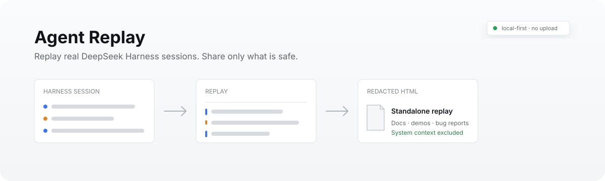
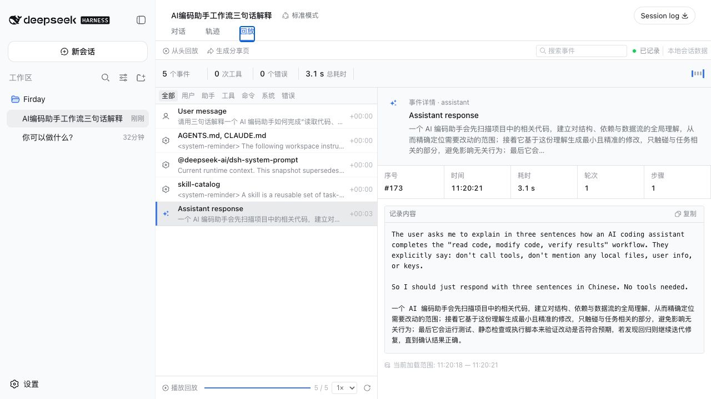
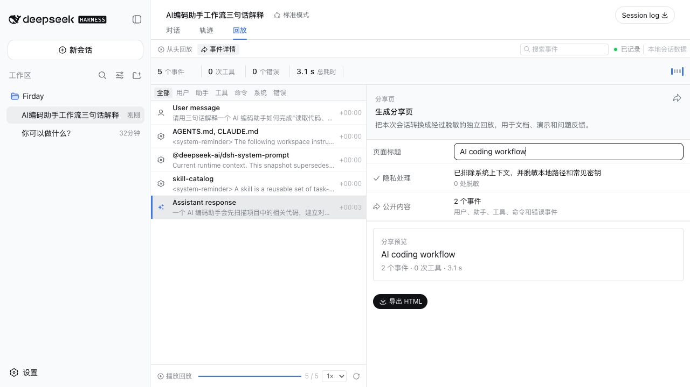

# Agent Replay for DeepSeek Harness

English | [简体中文](README.md)

<p align="center">
  
</p>

<p align="center">
  <a href="https://github.com/forrestsweet/dsh-agent-replay/actions/workflows/ci.yml"></a>
  <a href="https://github.com/forrestsweet/dsh-agent-replay/stargazers"></a>
  <a href="LICENSE"></a>
  <a href="https://github.com/topics/dsh-plugin"></a>
</p>

**Replay what an agent actually did, then export a safer version to share.** Agent Replay adds a native **Replay** tab to DeepSeek Harness. It turns real session messages, model responses, tool calls, commands, errors, and timing into a searchable timeline and a standalone HTML replay.

## See it in 10 seconds

| Replay the real session | Prepare a share-safe export |
| --- | --- |
|  |  |

1. Open any non-empty Harness session and select **Replay**.
2. Search, filter, inspect, or play events with their recorded timing.
3. Select **Create share page** and export one interactive `.html` file.

## Why this exists

Harness already ships **Trajectory**, an excellent developer diagnostics surface. Agent Replay complements it instead of replacing it:

| | Harness Trajectory | Agent Replay |
| --- | --- | --- |
| Primary job | Inspect and debug the complete event ledger | Replay and communicate a session |
| Audience | Agent developers | Teammates, maintainers, docs readers |
| Data | Raw requests, usage, timing, event detail | Selected messages, tools, commands, errors, timing |
| Sharing | In-product diagnosis | Redacted, standalone interactive HTML |
| Privacy boundary | Full local diagnostic context | System events excluded; common paths and secrets redacted |

## Features

- Native session-scoped `conversation.view` tab
- Real Harness snapshot data, including messages, tools, commands, errors, timestamps, and durations
- Recorded-time playback at 1×, 2×, or 4×
- Event search, type filters, detail inspection, copy, and older-history loading
- Standalone HTML export with a Trajectory-like ledger, overview lanes, inspector, dark mode, and no runtime dependency
- Share selection that excludes system/context events and assistant reasoning
- Built-in redaction for macOS/Windows user paths, common token shapes, bearer tokens, and key/value credentials
- English and Chinese UI, following the active Harness locale
- Official Harness primitives, semantic tokens, dimensions, hover states, icons, and light/dark behavior

## Install

### From source

Requirements: Node.js `22.19+` (or `24+`), pnpm, and a working [DeepSeek Harness](https://github.com/deepseek-ai/deepseek-harness) installation.

```bash
git clone https://github.com/forrestsweet/dsh-agent-replay.git
cd dsh-agent-replay
pnpm install
pnpm check
dsh plugin --profile web add .
dsh web
```

Open a non-empty session and select **Replay** beside Chat and Trajectory.

### Directly from GitHub

```bash
dsh plugin --profile web add github:forrestsweet/dsh-agent-replay
```

Git dependencies run this repository's `prepare` build. pnpm 10 may ask you to allow the package build in the profile's `pnpm-workspace.yaml`; review the source, allow `dsh-agent-replay`, and rerun the command. Pin a commit SHA when reproducibility matters. See the official [Harness publishing guide](https://github.com/deepseek-ai/deepseek-harness/blob/master/docs/user/develop/basic/publish.md#installing-from-github-the-build-script-catch).

### Remove

```bash
dsh plugin --profile web remove dsh-agent-replay
```

## Privacy model

Agent Replay runs in the Harness web client and reads the session snapshot already available there. It does not upload session content and does not require another model key.

Before HTML export it:

- excludes system/context events and live/incomplete events;
- exports the assistant's final text instead of hidden reasoning;
- replaces `/Users/<name>` and `C:\\Users\\<name>` prefixes;
- redacts common GitHub/OpenAI/Slack-style tokens, bearer tokens, and credential assignments.

Redaction is a safety net, not a guarantee. Always review an exported replay before publishing it. If you find a bypass, please follow [SECURITY.md](SECURITY.md) instead of opening a public issue.

## Development

```bash
pnpm install
pnpm typecheck
pnpm test
pnpm build
npm pack --dry-run --ignore-scripts
```

The plugin has two entry points:

- `src/index.ts` is the Harness host bundle entry.
- `src/client/index.tsx` registers the Replay view and renders session data.
- `src/privacy.ts` owns independently tested public-event selection and redaction.
- `cordis.patch.yml` composes the plugin into a Harness profile.

The UI deliberately follows `ui-trajectory` and `ui-primitives` from DeepSeek Harness. Contributions should reuse Harness primitives and `--dsw-*` semantic tokens rather than introduce a separate visual system.

## Compatibility

The current release targets DeepSeek Harness `0.1.0-rc.5+` and is tested against `0.1.0-rc.6` development packages. Harness is pre-1.0, so client slot or snapshot contracts may change. Open a compatibility issue with both versions when reporting a regression.

Issues and pull requests are welcome. Start with [CONTRIBUTING.md](CONTRIBUTING.md), and see [CHANGELOG.md](CHANGELOG.md) for release history.

## License

[MIT](LICENSE) © Agent Replay contributors.
